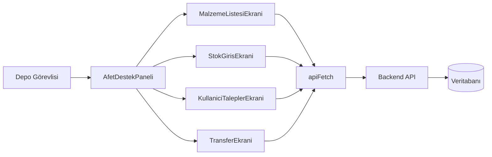
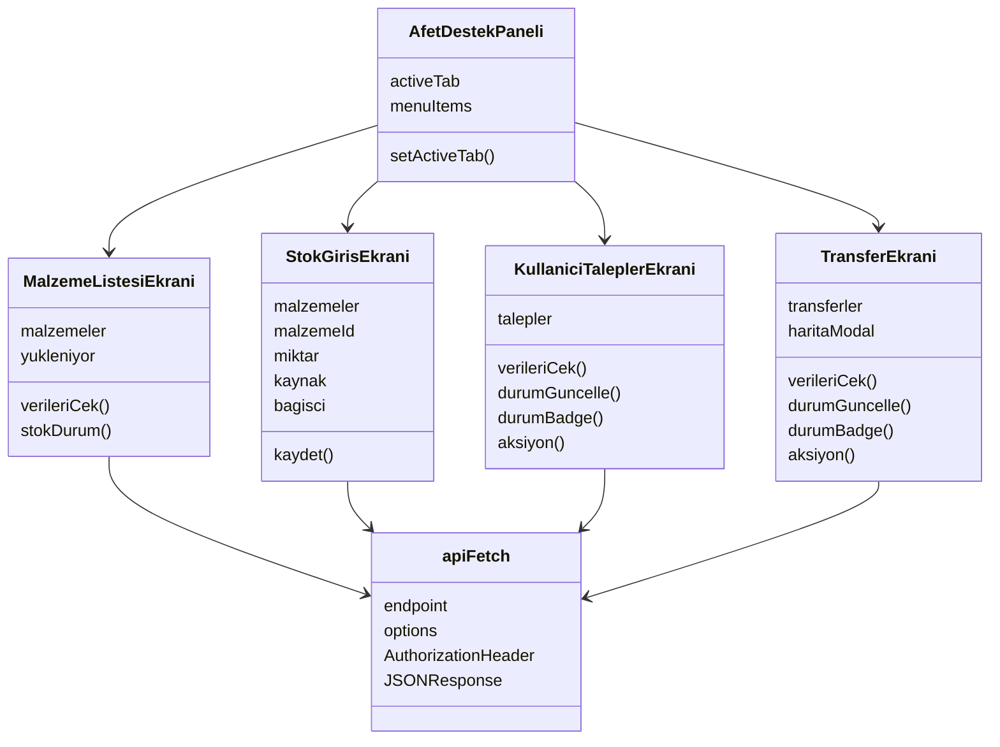
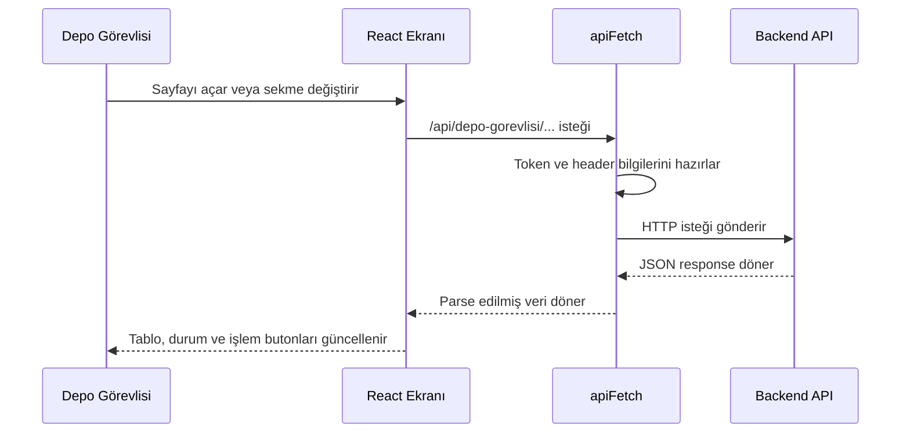

# Afet Destek Yönetimi - Proje Dokümantasyonu

## 1. Projenin Amacı

Bu proje, afet durumlarında depo görevlisinin malzeme stoklarını, kullanıcı taleplerini ve depolar arası transferleri yönetebilmesi için hazırlanmış bir React tabanlı yönetim panelidir.

Uygulama frontend tarafında çalışır ve backend API'lerine `/api/...` yolları üzerinden istek atar. Backend adresi `.env` dosyasındaki `VITE_BACKEND_URL` değişkeninden alınır.

## 2. Kullanılan Teknolojiler

- React: Arayüz bileşenlerini oluşturmak için kullanılır.
- Vite: Geliştirme sunucusu ve build aracı olarak kullanılır.
- Tailwind CSS sınıfları: Sayfa tasarımı ve responsive düzen için kullanılır.
- Lucide React: Menü ve işlem ikonları için kullanılır.
- Leaflet: Transfer konumu/harita gösterimi için kullanılır.

## 3. Çalıştırma Bilgileri

Geliştirme ortamında frontend şu komutla başlatılır:

```bash
npm run dev
```

Mevcut `.env` ayarları:

```env
VITE_FRONTEND_PORT=5173
VITE_BACKEND_URL=https://human-evacuee-thieving.ngrok-free.dev
VITE_API_BASE_URL=
VITE_USE_DEMO_DATA=false
```

Bu ayara göre:

- Frontend adresi: `http://localhost:5173`
- Backend API adresi: `https://human-evacuee-thieving.ngrok-free.dev`
- Frontend içinde `/api/depo-gorevlisi/malzeme` çağrısı yapılınca istek backend tarafında şu adrese gider:

```text
https://human-evacuee-thieving.ngrok-free.dev/api/depo-gorevlisi/malzeme
```

## 4. API Bağlantı Yapısı

API istekleri `src/App.jsx` içinde bulunan `apiFetch` fonksiyonu ile yapılır.

### `apiFetch(endpoint, options)`

Görevi:

- API endpoint'ine `fetch` ile istek atar.
- `Content-Type: application/json` header'ını body varsa ekler.
- `localStorage` içinde `token` varsa `Authorization: Bearer <token>` olarak gönderir.
- Ngrok kullanılıyorsa `ngrok-skip-browser-warning` header'ını ekler.
- Hata varsa ilgili hatayı fırlatır.
- Response boş değilse JSON olarak parse eder.

Token şu şekilde okunur:

```js
const TOKEN = localStorage.getItem('token');
```

Bu yüzden yetkili endpointlerin çalışması için tarayıcıda JWT token bulunmalıdır.

Token elle eklemek gerekirse:

```js
localStorage.setItem("token", "JWT_TOKEN_BURAYA")
```

Sonra sayfa yenilenmelidir.

## 5. Demo Veri Yapısı

Dosyada şu demo veri sabitleri bulunur:

- `DEMO_MALZEMELER`
- `DEMO_TALEPLER`
- `DEMO_TRANSFERLER`

Bunlar backend kapalıyken test amaçlı kullanılabilir. Ancak şu an `.env` içinde:

```env
VITE_USE_DEMO_DATA=false
```

olduğu için demo veri kapalıdır. Yani uygulama gerçek API'den veri çekmeye çalışır.

## 6. Ana Bileşenler

### `AfetDestekPaneli`

Uygulamanın ana bileşenidir.

Görevleri:

- Sol menüyü oluşturur.
- Aktif sekmeyi `activeTab` state'i ile tutar.
- Seçilen menüye göre ilgili ekranı gösterir.

Menü sekmeleri:

- `malzeme-listesi`: Depo Malzemeleri
- `stok-giris`: Stok Girişi
- `kul-talepler`: Kullanıcı Talepleri
- `transfer`: Depolar Arası Transfer

Kullandığı state:

```js
const [activeTab, setActiveTab] = useState('malzeme-listesi');
```

## 7. Sayfalar / Ekranlar

### 7.1. Depo Malzemeleri Ekranı

Bileşen adı:

```js
MalzemeListesiEkrani
```

API endpoint:

```text
GET /api/depo-gorevlisi/malzeme
```

Görevleri:

- Depodaki malzemeleri listeler.
- Toplam malzeme çeşidini gösterir.
- Kritik stok sayısını gösterir.
- Stokta olmayan ürün sayısını gösterir.
- Her 30 saniyede bir API'den veriyi tekrar çeker.

Kullandığı state'ler:

```js
const [malzemeler, setMalzemeler] = useState([]);
const [yukleniyor, setYukleniyor] = useState(true);
```

Tabloda gösterilen alanlar:

- Malzeme Adı
- ID
- Kategori
- Stok
- Durum

Stok durumu şu kurala göre hesaplanır:

- `stok === 0`: Stok Yok
- `stok < 20`: Kritik
- diğer durumlar: Normal

### 7.2. Stok Girişi Ekranı

Bileşen adı:

```js
StokGirisEkrani
```

Kullandığı endpointler:

```text
GET  /api/depo-gorevlisi/malzeme
POST /api/depo-gorevlisi/stok
```

Görevleri:

- Stok eklenecek malzemeyi seçtirir.
- Miktar girişi alır.
- Kaynak türü seçtirir: `BAGIS` veya `TRANSFER`
- Bağışçı adını opsiyonel olarak alır.
- Stok girişini backend'e gönderir.
- Başarılı işlemden sonra son girişleri ekranda gösterir.

Kullandığı state'ler:

```js
const [malzemeler, setMalzemeler] = useState([]);
const [malzemeId, setMalzemeId] = useState('');
const [miktar, setMiktar] = useState('');
const [kaynak, setKaynak] = useState('BAGIS');
const [bagisci, setBagisci] = useState('');
const [gecmis, setGecmis] = useState([]);
const [gonderiyor, setGonderiyor] = useState(false);
```

Backend'e gönderilen örnek body:

```json
{
  "malzemeId": 1,
  "miktar": 100,
  "kaynakTuru": "BAGIS",
  "bagisci": "Ahmet Yılmaz"
}
```

### 7.3. Kullanıcı Talepleri Ekranı

Bileşen adı:

```js
KullaniciTaleplerEkrani
```

Kullandığı endpointler:

```text
GET /api/depo-gorevlisi/talepler/gonderilecek
PUT /api/depo-gorevlisi/talep/{talepId}/hazirla
PUT /api/depo-gorevlisi/talep/{talepId}/yola-cik
PUT /api/depo-gorevlisi/talep/{talepId}/teslim-edildi
```

Görevleri:

- Depoya atanmış kullanıcı taleplerini listeler.
- Talep içindeki malzemeleri ve miktarları gösterir.
- Talebin kargo durumunu gösterir.
- Duruma göre işlem butonu gösterir.

Duruma göre butonlar:

- Durum yoksa veya `BEKLEMEDE` ise: Hazırla
- Durum `HAZIRLANIYOR` ise: Yola Çık
- Durum `YOLDA` ise: Teslim Edildi
- Durum `TESLIM_EDILDI` ise: Tamamlandı

Kullandığı state'ler:

```js
const [talepler, setTalepler] = useState([]);
const [yukleniyor, setYukleniyor] = useState(true);
```

Bu ekran da her 30 saniyede bir API'den tekrar veri çeker.

### 7.4. Depolar Arası Transfer Ekranı

Bileşen adı:

```js
TransferEkrani
```

Kullandığı endpointler:

```text
GET /api/depo-gorevlisi/depolar-arasi-transfer/aktif
PUT /api/depo-gorevlisi/depolar-arasi-transfer/{talepId}/hazirla
PUT /api/depo-gorevlisi/depolar-arasi-transfer/{talepId}/yola-cik
PUT /api/depo-gorevlisi/depolar-arasi-transfer/{talepId}/teslim-edildi
```

Görevleri:

- Aktif depolar arası transfer taleplerini listeler.
- Transfer önceliğini gösterir.
- Taşınacak malzemeleri gösterir.
- Transfer durumunu gösterir.
- Duruma göre işlem butonu gösterir.
- Harita/konum modalı açar.

Kullandığı state'ler:

```js
const [transferler, setTransferler] = useState([]);
const [yukleniyor, setYukleniyor] = useState(true);
const [haritaModal, setHaritaModal] = useState(null);
const haritaRef = useRef(null);
const mapInstanceRef = useRef(null);
```

Transfer API'sinde backend bazen `transferDurumu`, frontend ise işlem için `kargoDurumu` kullanır. Bu farkı düzeltmek için `normalizeTransfer` fonksiyonu vardır.

### `normalizeTransfer`

Görevi:

- Backend'den gelen `transferDurumu` alanını frontend'in kullandığı `kargoDurumu` alanına çevirir.
- `latitude` ve `longitude` alanlarını sayıya dönüştürür.

```js
const normalizeTransfer = (transfer) => ({
  ...transfer,
  kargoDurumu: transfer.kargoDurumu || transfer.transferDurumu,
  latitude: Number(transfer.latitude),
  longitude: Number(transfer.longitude),
});
```

## 8. Harita Yapısı

Harita için Leaflet kullanılır.

Kodda sabit depo koordinatları vardır:

```js
const DEPO_KOORDINATLARI = {
  'Ankara Merkez Depo': [39.9334, 32.8597],
  'İstanbul Kuzey Depo': [41.0082, 28.9784],
  'İzmir Güney Depo': [38.4192, 27.1287],
  'Bursa Depo': [40.1885, 29.0610],
  'Erzurum Depo': [39.9000, 41.2700],
};
```

Transfer ekranında harita modalı açıldığında:

- Leaflet map oluşturulur.
- OpenStreetMap tile layer eklenir.
- Kaynak ve hedef noktaları marker olarak gösterilir.
- İki nokta arasında çizgili rota çizilir.

## 9. Backend ile Entegrasyon Notları

Backend dokümantasyonuna göre depo görevlisi endpointleri JWT token ister.

Bu nedenle:

1. Kullanıcı login olur.
2. SMS doğrulama yapılır.
3. Backend JWT token döner.
4. Token frontend tarafında `localStorage` içine kaydedilir.
5. API istekleri bu token ile yapılır.

Token yoksa backend `401 Unauthorized` dönebilir.


## UML Diyagramları

Bu bölümde projenin temel akışı ve bileşen ilişkileri UML mantığıyla özetlenmiştir.

### Bileşen Diyagramı



### Sınıf / Bileşen İlişki Diyagramı



### API Çağrı Sırası Diyagramı



## Proje Dosyaları

Önemli dosyalar:

- `src/App.jsx`: Ana React uygulaması ve tüm ekran bileşenleri.
- `src/main.jsx`: React uygulamasını DOM'a bağlar.
- `vite.config.js`: Vite ayarları ve API proxy yapılandırması.
- `.env`: Frontend portu ve backend URL bilgisi.
- `package.json`: Proje bağımlılıkları ve scriptler.

## Kontrol Komutları

Kod kalitesini kontrol etmek için:

```bash
npm run lint
```

Production build almak için:

```bash
npm run build
```

Geliştirme sunucusunu başlatmak için:

```bash
npm run dev
```
